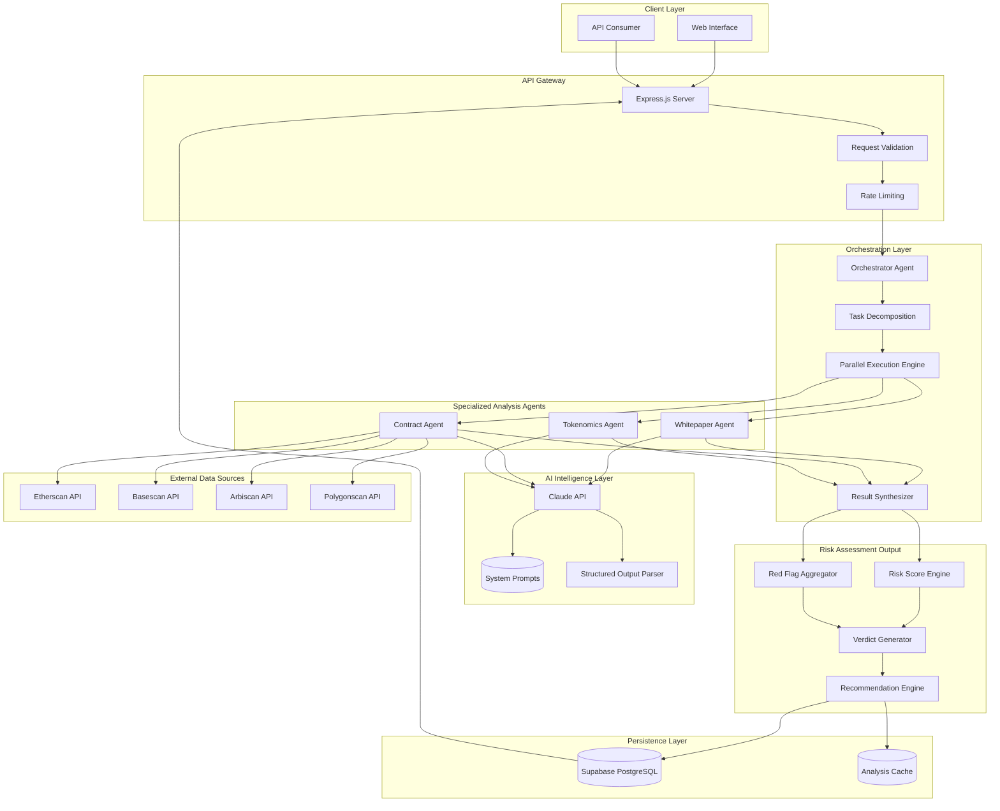
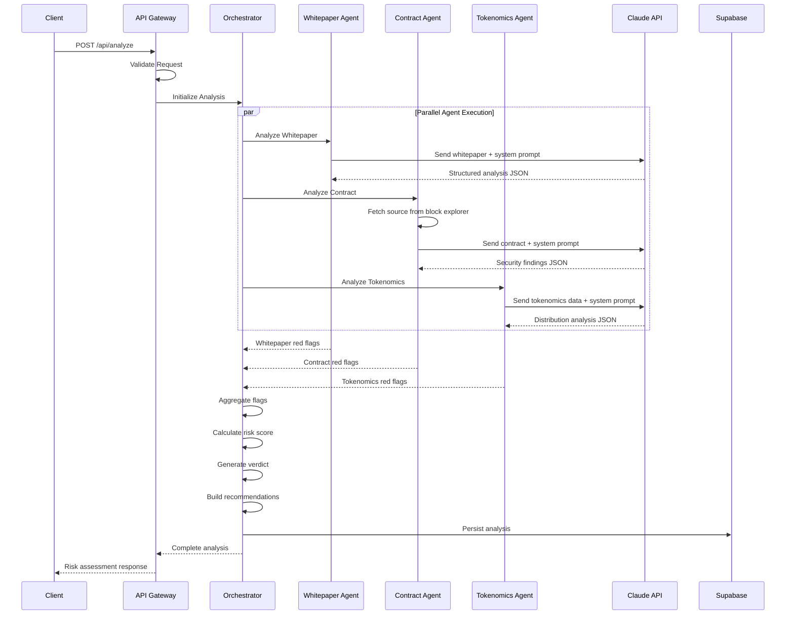
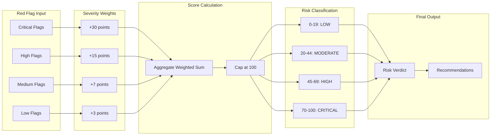
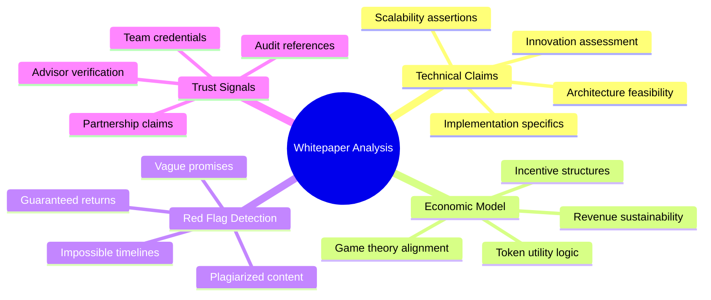
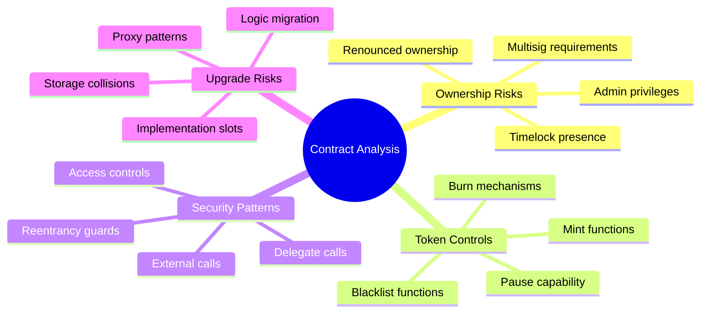
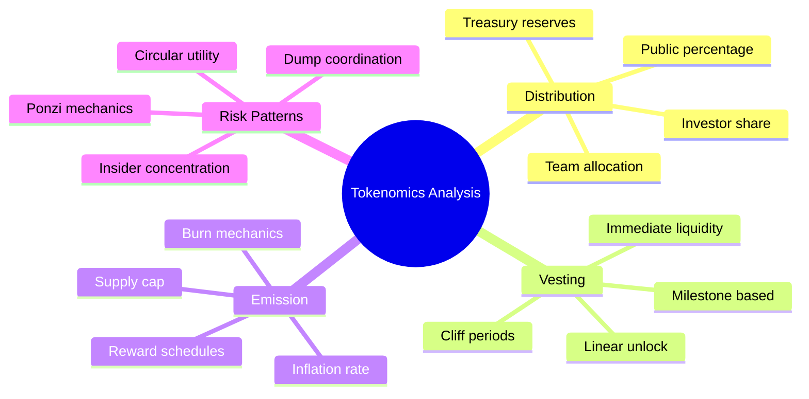
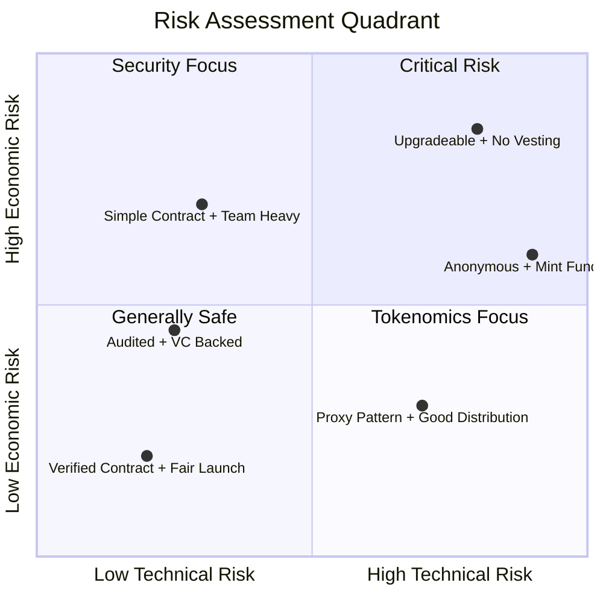
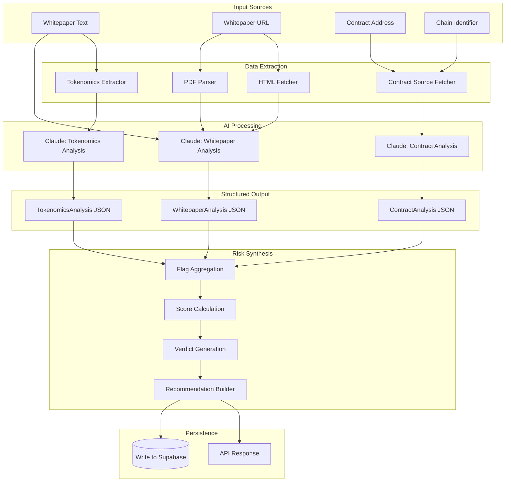
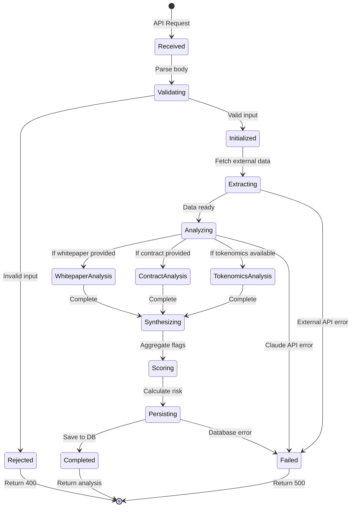
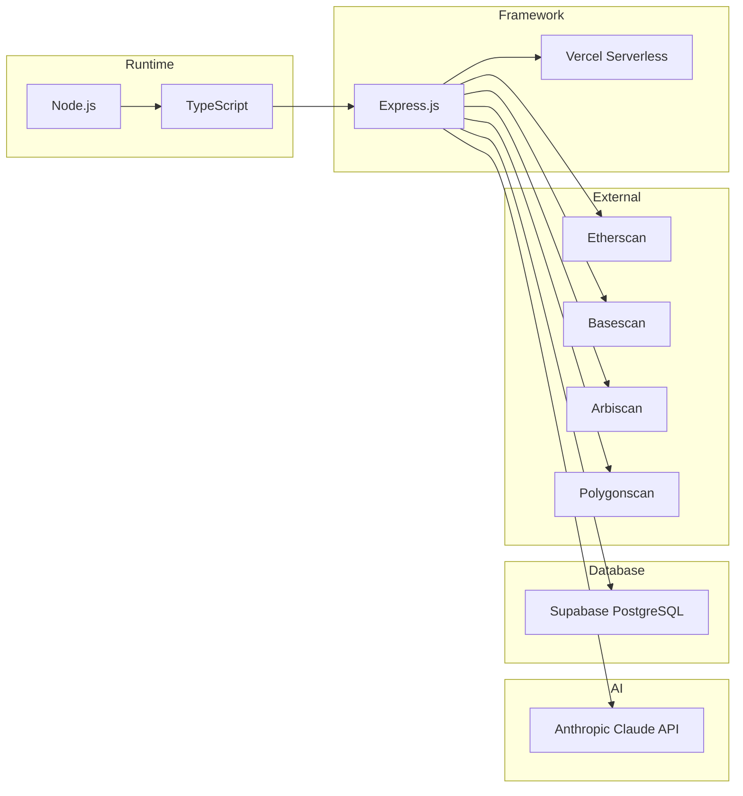

# Crypto Due Diligence Agent

An autonomous AI-powered due diligence system that performs institutional-grade technical analysis on cryptocurrency projects in real-time. The agent orchestrates multiple specialized analysis modules to evaluate smart contract security, whitepaper legitimacy, and tokenomics sustainability, delivering comprehensive risk assessments in seconds rather than the days or weeks traditional audits require.

## The Problem

The cryptocurrency ecosystem moves at an unforgiving pace. New projects launch daily, each presenting potential opportunity alongside substantial risk. Traditional due diligence is slow, expensive, and doesn't scale. Retail investors lack access to the sophisticated analysis tools that institutions use, while even professional analysts struggle to keep pace with the volume of new projects entering the market.

Rug pulls, honeypot contracts, and vaporware whitepapers have collectively drained billions from the ecosystem. The asymmetry is stark: bad actors can deploy a malicious project in minutes, but thorough analysis takes days. By the time red flags surface through conventional means, the damage is done.

## The Solution

This system inverts the asymmetry. By combining large language model reasoning with deterministic smart contract analysis, the agent performs multi-dimensional due diligence that would traditionally require a team of specialists: a security auditor, a tokenomics analyst, and a technical writer reviewer, all working in parallel.

The architecture employs a hierarchical agent pattern. A central orchestrator delegates to domain-specific analysis agents, each operating with carefully tuned system prompts that encode years of accumulated knowledge about crypto-specific red flags, attack vectors, and manipulation patterns. The agents don't just parse documents; they reason about implications, cross-reference claims against technical feasibility, and synthesize findings into actionable risk scores.

## System Architecture


## Agent Communication Flow


## Risk Scoring Pipeline


## Analysis Modules

### Whitepaper Agent


The whitepaper agent performs deep semantic analysis on project documentation. Unlike simple keyword matching, it evaluates the logical coherence of technical claims, identifies impossible promises (guaranteed returns, physics-defying scalability claims), and measures buzzword density as a proxy for substance. The agent maintains an internal model of what legitimate blockchain architectures look like and flags deviations from established technical patterns.

**Key detection capabilities:**
- Plagiarism indicators and recycled content patterns
- Vague technical claims that lack implementation specifics
- Economic models that violate basic game theory
- Timeline feasibility given stated technical scope
- Team credential verification gaps

### Contract Agent


The contract agent analyzes smart contract source code through the lens of security and centralization risk. It identifies ownership patterns that grant excessive control, mint functions without supply caps, pause mechanisms that could freeze user funds, and proxy patterns that allow silent logic upgrades. The analysis goes beyond simple function detection to evaluate how these capabilities interact and compound risk.

**Key detection capabilities:**
- Reentrancy vulnerability patterns
- Unlimited minting authority
- Owner-controlled transfer restrictions
- Hidden fee mechanisms
- Self-destruct capabilities
- Upgradeable proxy patterns without timelocks

### Tokenomics Agent


The tokenomics agent evaluates the economic sustainability of token distribution and emission schedules. It identifies allocation patterns that favor insiders, vesting schedules that create coordinated dump risk, and inflationary models that dilute retail holders. The agent understands that tokenomics is game theory: it evaluates incentive alignment between teams, investors, and public participants.

**Key detection capabilities:**
- Excessive team/insider allocations (over 20%)
- Missing or abbreviated vesting periods
- Cliff concentrations that enable coordinated selling
- Circular utility models (tokens for tokens)
- Unsustainable yield mechanics

## Risk Classification Matrix


## Data Flow Architecture


## State Machine: Analysis Lifecycle


## API Endpoints

| Method | Endpoint | Description |
|--------|----------|-------------|
| GET | `/api/health` | Service health check |
| POST | `/api/analyze` | Full multi-agent analysis |
| POST | `/api/analyze/whitepaper` | Whitepaper-only analysis |
| POST | `/api/analyze/contract` | Contract-only analysis |
| GET | `/api/analysis/:id` | Retrieve saved analysis |

See `API_DOCUMENTATION.md` for complete request/response specifications.

## Risk Scoring Methodology

The system produces a composite risk score from 0-100 using severity-weighted flag aggregation:

| Severity | Weight | Examples |
|----------|--------|----------|
| Critical | +30 | Guaranteed returns, unlimited mint, no vesting |
| High | +15 | Anonymous team, proxy upgrades, over 30% team allocation |
| Medium | +7 | High buzzword density, missing audit, short vesting |
| Low | +3 | Minor documentation gaps, standard owner functions |

**Final risk classification:**

| Score | Level | Interpretation |
|-------|-------|----------------|
| 0-19 | Low | Standard risk profile, proceed with normal caution |
| 20-44 | Moderate | Notable concerns requiring additional research |
| 45-69 | High | Significant red flags, elevated caution warranted |
| 70-100 | Critical | Severe risk indicators, extreme caution advised |

## Tech Stack


- **Runtime:** Node.js + TypeScript
- **Framework:** Express.js
- **AI Engine:** Claude (Anthropic API)
- **Database:** Supabase (PostgreSQL)
- **Deployment:** Vercel (Serverless)
- **Chain Data:** Etherscan, Basescan, Arbiscan, Polygonscan APIs

## Installation
```bash
# Clone the repository
git clone https://github.com/yourusername/crypto-due-diligence-agent.git
cd crypto-due-diligence-agent

# Install dependencies
npm install

# Configure environment
cp .env.example .env
# Add your keys to .env:
#   ANTHROPIC_API_KEY=your_key
#   SUPABASE_URL=your_url
#   SUPABASE_ANON_KEY=your_key

# Run locally
npm run dev

# Deploy to production
vercel --prod
```

## Environment Variables

| Variable | Description |
|----------|-------------|
| `ANTHROPIC_API_KEY` | Claude API key from Anthropic |
| `SUPABASE_URL` | Supabase project URL |
| `SUPABASE_ANON_KEY` | Supabase anonymous key |

## Project Structure
```
crypto-due-diligence-agent/
├── api/
│   └── index.ts              # Express server + route handlers
├── src/
│   ├── agents/
│   │   ├── orchestrator.agent.ts   # Central coordination
│   │   ├── whitepaper.agent.ts     # Document analysis
│   │   ├── contract.agent.ts       # Smart contract analysis
│   │   └── tokenomics.agent.ts     # Economic analysis
│   ├── services/
│   │   ├── claude.service.ts       # Anthropic API integration
│   │   └── supabase.service.ts     # Database operations
│   ├── types/
│   │   └── index.ts                # TypeScript interfaces
│   └── utils/
│       └── extractors.ts           # Data extraction utilities
├── vercel.json                     # Deployment configuration
├── API_DOCUMENTATION.md            # Frontend integration docs
└── README.md
```

## License

MIT